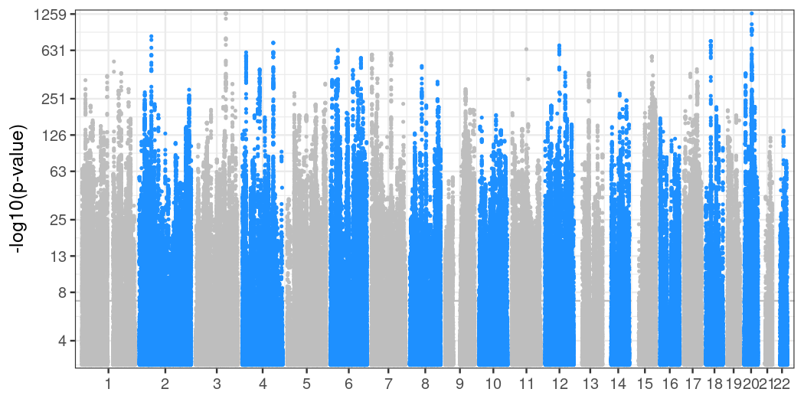
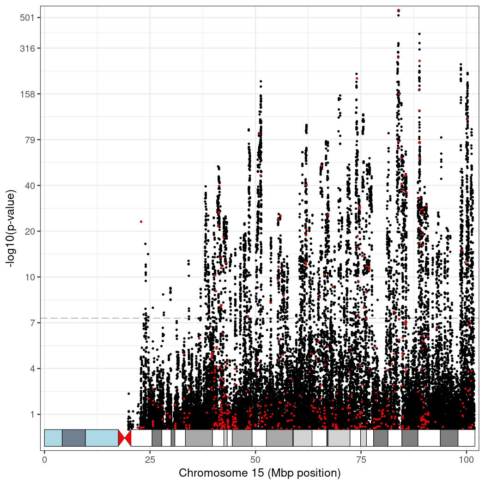
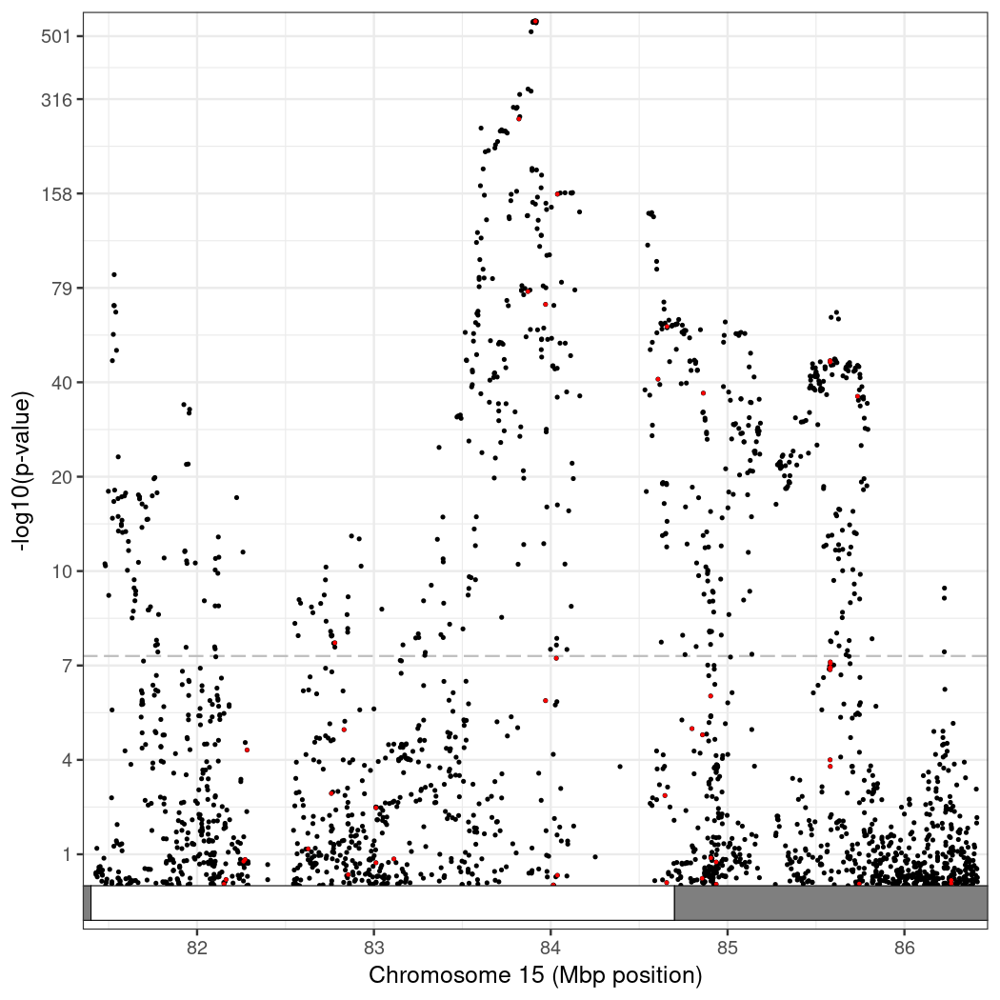

score
=====

A set of tools to work with summary statistics files following the [GWAS-VCF specification](http://github.com/MRCIEU/gwas-vcf-specification). We encourage users to adopt the GWAS-VCF specification rather than the [GWAS-SSF specification](http://ebispot.github.io/gwas-blog/new-standard-for-gwas-summary-statistics) promoted by the [GWAS catalog](http://www.ebi.ac.uk/gwas/) as the latter is affected by [issues](http://github.com/EBISPOT/gwas-summary-statistics-standard/issues/4) and furthermore we believe that many common uses are better addressed by using the more general VCF specification. If you are planning to publish your summary statistics, we encourage you to submit them as GWAS-VCF files or as both GWAS-VCF and as GWAS-SSF files. The latter can be generated from the former with the following command
```
(echo -e "chromosome\tbase_pair_location\teffect_allele\tother_allele\tbeta\tstandard_error\teffect_allele_frequency\tp_value";
bcftools query -s SM -f "%CHROM\t%POS\t%ALT\t%REF[\t%ES\t%SE\t%AF\t%LP]\n" gwas-vcf.vcf | \
  sed 's/^chr//;s/^X/23/;s/^Y/24/;s/^MT/25/;s/^M/25/;s/\t\./\tNA/g' | awk -F"\t" -v OFS="\t" '{$8=10^(-$8); print}') > gwas-ssf.tsv
```

If you use BCFtools/liftover in your publication, please cite the following paper from [2024](http://doi.org/10.1093/bioinformatics/btae038)
```
Genovese G., McCarroll S. et al. BCFtools/liftover: an accurate and comprehensive tool to convert genetic variants across genome assemblies. Bioinformatics 40, Issue 2 (2024). [PMID: 38261650] [DOI: 10.1093/bioinformatics/btae038]
```

If you use BCFtools/blup or BCFtools/pgs in your publication, please cite the following paper from [2023](http://doi.org/10.1038/s41588-023-01487-8)
```
Nowbandegani P., O’Connor L.J. et al. (2023) Extremely sparse models of linkage disequilibrium in ancestrally diverse association studies. Nat Genet, 55, 1494–1502. [PMID: 37640881] [DOI: 10.1038/s41588-023-01487-8]
```

If you use BCFtools/metal in your publication, please cite the following paper from [2010](http://doi.org/10.1093/bioinformatics/btq340)
```
Willer, C. J., Li, Y. & Abecasis, G. R. (2010) METAL: fast and efficient meta-analysis of genomewide association scans. Bioinformatics 26, 2190–2191. [PMID: 20616382] [DOI: 10.1093/bioinformatics/btq340]
```

If you use any of the other tools in your publication, please cite this website. For any feedback or questions, contact the [author](mailto:giulio.genovese@gmail.com)

Examples of how to convert existing summary statistics to polygenic score loadings using BCFtools/munge, BCFtools/liftover, and BCFtools/pgs can be found [here](examples.md)

<!--ts-->
   * [Usage](#usage)
   * [Installation](#installation)
      * [CHOLMOD](#cholmod)
      * [Intel MKL](#intel-mkl)
      * [Column Headers Mappings](#column-headers-mappings)
      * [LDGM-VCF Specification](#ldgm-vcf-specification)
      * [LDGM Matrices](#ldgm-matrices)
   * [Convert summary statistics](#convert-summary-statistics)
   * [Liftover VCFs](#liftover-vcfs)
   * [Run meta-analysis](#run-meta-analysis)
   * [Compute polygenic score loadings](#compute-polygenic-score-loadings)
     * [Compute best linear unbiased predictor](#compute-best-linear-unbiased-predictor)
   * [Compute polygenic scores](#compute-polygenic-scores)
   * [Annotation](#annotation)
   * [Plotting](#plotting)
   * [Acknowledgements](#acknowledgements)
<!--te-->

Usage
=====

Polygenic score tool:
```
Usage: bcftools +score [options] <in.vcf.gz> [<score1.gwas.vcf.gz> <score2.gwas.vcf.gz> ...]
Plugin options:
       --use <tag>               FORMAT tag to use to compute allele dosages: GP, AP, HDS, DS, GT, AS
       --summaries <dir|file>    summary statistics files from directory or list from file
       --q-score-thr LIST        comma separated list of p-value thresholds
       --counts                  include SNP counts in the output table
   -o, --output <file.tsv>       write output to a file [standard output]
       --sample-header           output header for sample ID column [SAMPLE]
   -e, --exclude <expr>          exclude sites for which the expression is true
   -f, --apply-filters <list>    require at least one of the listed FILTER strings (e.g. "PASS,.")
   -i, --include <expr>          select sites for which the expression is true
   -r, --regions <region>        restrict to comma-separated list of regions
   -R, --regions-file <file>     restrict to regions listed in a file
       --regions-overlap 0|1|2   Include if POS in the region (0), record overlaps (1), variant overlaps (2) [1]
   -t, --targets [^]<region>     restrict to comma-separated list of regions. Exclude regions with "^" prefix
   -T, --targets-file [^]<file>  restrict to regions listed in a file. Exclude regions with "^" prefix
       --targets-overlap 0|1|2   Include if POS in the region (0), record overlaps (1), variant overlaps (2) [0]
   -s, --samples [^]<list>       comma separated list of samples to include (or exclude with "^" prefix)
   -S, --samples-file [^]<file>  file of samples to include (or exclude with "^" prefix)
       --force-samples           only warn about unknown subset samples

TSV Summary Statistics Options:
   -c, --columns <preset>        column headers from preset (PLINK/PLINK2/REGENIE/SAIGE/BOLT/METAL/PGS/SSF)
   -C, --columns-file <file>     column headers from tab-delimited file
       --use-variant-id          use variant_id to match variants rather than chromosome and base_pair_location

Examples:
   bcftools +score --use DS -o scores.tsv input.bcf -c PLINK score.assoc
   bcftools +score --use DS -o scores.tsv input.bcf -C colheaders.tsv PGC3_SCZ_wave3_public.clumped.v2.tsv.gz
   bcftools +score --use GT -o scores.tsv --q-score-thr 1e-8,1e-7,1e-6,1e-5,1e-4,0.001,0.01,0.05 input.bcf -c GWAS-SSF PGS000001.txt.gz
   bcftools +score --use DS -o scores.tsv -i 'INFO>0.8 && AF>0.01 && AF<0.99' input.bcf -c GWAS-SSF PGS000001.txt.gz PGS000002.txt.gz
```

Munge summary statistics tool:
```
Usage: bcftools +munge [options] <score.gwas.ssf.tsv>
Plugin options:
   -c, --columns <preset>          column headers from preset (PLINK/PLINK2/REGENIE/SAIGE/BOLT/METAL/PGS/SSF)
   -C, --columns-file <file>       column headers from tab-delimited file
   -f, --fasta-ref <file>          reference sequence in fasta format
       --fai <file>                reference sequence .fai index
       --set-cache-size <int>      select fasta cache size in bytes
       --iffy-tag <string>         FILTER annotation tag to record whether reference allele could not be determined [IFFY]
       --mismatch-tag <string>     FILTER annotation tag to record whether reference does not match any allele [REF_MISMATCH]
   -s, --sample-name <string>      sample name for the phenotype [SAMPLE]
       --ns <float>                number of samples
       --nc <float>                number of cases
       --ne <float>                effective sample size
       --no-version                do not append version and command line to the header
   -o, --output <file>             write output to a file [no output]
   -O, --output-type u|b|v|z[0-9]  u/b: un/compressed BCF, v/z: un/compressed VCF, 0-9: compression level [v]
       --threads <int>             use multithreading with INT worker threads [0]
   -W, --write-index[=FMT]         Automatically index the output files [off]

Examples:
      bcftools +munge -c PLINK -f human_g1k_v37.fasta -Ob -o score.bcf score.assoc
      bcftools +munge -C colheaders.tsv -f human_g1k_v37.fasta -s SCZ_2022 -Ob -o PGC3_SCZ.bcf PGC3_SCZ.tsv.gz
```

Liftover VCFs tool:
```
Usage: bcftools +liftover [General Options] -- [Plugin Options]
Options:
   run "bcftools plugin" for a list of common options

Plugin options:
   -s, --src-fasta-ref <file>      source reference sequence in fasta format
   -f, --fasta-ref <file>          destination reference sequence in fasta format
       --set-cache-size <int>      select fasta cache size in bytes
   -c, --chain <file>              UCSC liftOver chain file
       --max-snp-gap <int>         maximum distance to merge contiguous blocks separated by same distance [1]
       --max-indel-inc <int>       maximum distance used to increase the size an indel during liftover [250]
       --lift-mt                   force liftover of MT/chrMT [automatically determined from contig lengths]
       --print-blocks <file>       output contiguous blocks used for the liftOver
       --no-left-align             do not attempt to left align indels after liftover
       --reject <file>             output variants that cannot be lifted over
   -O, --reject-type u|b|v|z[0-9]  u/b: un/compressed BCF, v/z: un/compressed VCF, 0-9: compression level [v]
       --write-src                 write the source contig/position/alleles for lifted variants
       --write-fail                write whether the 5' and 3' anchors have failed to lift
       --write-nw                  write the Needleman-Wunsch alignments when required
       --write-reject              write the reason variants cannot be lifted over

Options for how to update INFO/FORMAT records:
       --fix-tags                  fix Number type for INFO/AC, INFO/AF, FORMAT/GP, and FORMAT/DS tags
       --lift-end                  lift the position of the INFO/END tag instead of recomputing it
        --flip-tag <string>         INFO annotation flag to record whether alleles are flipped [FLIP]
       --swap-tag <string>         INFO annotation to record when alleles are swapped [SWAP]
       --drop-tags <list>          tags to drop when alleles are swapped [.]
       --ac-tags <list>            AC-like tags (must be Number=A,Type=Integer/Float) [INFO/AC,FMT/AC]
       --af-tags <list>            AF-like tags (must be Number=A,Type=Float) [INFO/AF,FMT/AF,FMT/AP1,FMT/AP2]
       --ds-tags <list>            DS-like tags (must be Number=A,Type=Float) [FMT/DS]
       --gt-tags <list>            tags with integers like FORMAT/GT (must be Type=Integer) [INFO/ALLELE_A,INFO/ALLELE_B]
       --es-tags <list>            GWAS-VCF tags (must be Number=A) [FMT/EZ,FMT/ES,FMT/ED]

Examples:
      bcftools +liftover -Ou input.hg19.bcf -- -s hg19.fa -f hg38.fa \
        -c hg19ToHg38.over.chain.gz | bcftools sort -Ob -o output.hg38.bcf -W
      bcftools +liftover -Ou GRCh38_dbSNPv156.vcf.gz -- -s hg38.fa -f chm13v2.0.fa \
        -c hg38ToHs1.over.chain.gz | bcftools sort -Oz -o chm13v2.0_dbSNPv156.vcf.gz -W=tbi

To obtain liftover chain files:
      wget http://hgdownload.cse.ucsc.edu/goldenpath/hg19/liftOver/hg19ToHg38.over.chain.gz
      wget http://ftp.ensembl.org/pub/assembly_mapping/homo_sapiens/GRCh37_to_GRCh38.chain.gz
      wget http://hgdownload.soe.ucsc.edu/goldenPath/hg38/liftOver/hg38ToHs1.over.chain.gz
```

Meta-analysis tool:
```
Usage: bcftools +metal [options] <score1.gwas.vcf.gz> <score2.gwas.vcf.gz> [<score3.gwas.vcf.gz> ...]
Plugin options:
       --summaries <file>          list of summary statistics VCFs from file
   -e, --exclude EXPR              Exclude sites for which the expression is true (see man page for details)
   -i, --include EXPR              Select sites for which the expression is true (see man page for details)
       --szw                       perform meta-analysis based on sample-size weighted scheme
                                   rather than inverse-variance weighted scheme
       --het                       perform heterogenity analysis
       --esd                       output effect size direction across studies
       --overlap                   perform sample overlap correction
       --no-version                do not append version and command line to the header
   -o, --output <file>             write output to a file [no output]
   -O, --output-type u|b|v|z[0-9]  u/b: un/compressed BCF, v/z: un/compressed VCF, 0-9: compression level [v]
   -r, --regions <region>          restrict to comma-separated list of regions
   -R, --regions-file <file>       restrict to regions listed in a file
       --regions-overlap 0|1|2     Include if POS in the region (0), record overlaps (1), variant overlaps (2) [1]
   -t, --targets [^]<region>       restrict to comma-separated list of regions. Exclude regions with "^" prefix
   -T, --targets-file [^]<file>    restrict to regions listed in a file. Exclude regions with "^" prefix
       --targets-overlap 0|1|2     Include if POS in the region (0), record overlaps (1), variant overlaps (2) [0]
       --threads <int>             use multithreading with INT worker threads [0]
   -W, --write-index[=FMT]         Automatically index the output files [off]

Examples:
      bcftools +metal -Ob -o ukb_mvp.gwas.bcf -i ukb.gwas.bcf mvp.gwas.bcf
      bcftools +metal -Ob -o ukb_mvp.gwas.bcf -i 'NS>1000 & AF>0.01 & AF<0.99' ukb.gwas.bcf mvp.gwas.bcf
      bcftools +metal -Ob -o ukb_mvp.gwas.bcf -i 'ID="rs1234" || ID="rs123456" || ID="rs123"' ukb.gwas.bcf mvp.gwas.bcf
```

Compute polygenic score loadings tool:
```
Usage: bcftools +pgs [options] <score.gwas.vcf.gz> [<ldgm.vcf.gz> <ldgm2.vcf.gz> ...]
Plugin options:
   -v, --verbose                   verbose output (specify twice to increase verbosity)
       --debug                     output matrix and vectors for one LD block to files in the current directory
       --ldgm-vcfs <list>          List of LDGM-VCF files to use
       --ldgm-vcfs-file <file>     File of list of LDGM-VCF files to use
   -e, --exclude EXPR              Exclude sites for which the expression is true (see man page for details)
   -i, --include EXPR              Select sites for which the expression is true (see man page for details)
       --no-version                do not append version and command line to the header
   -o, --output <file>             write output to a file [no output]
   -O, --output-type u|b|v|z[0-9]  u/b: un/compressed BCF, v/z: un/compressed VCF, 0-9: compression level [v]
   -l, --log <file>                write log to file [standard error]
   -r, --regions <region>          restrict to comma-separated list of regions
   -R, --regions-file <file>       restrict to regions listed in a file
       --regions-overlap 0|1|2     Include if POS in the region (0), record overlaps (1), variant overlaps (2) [1]
   -s, --samples <list>            List of summary statitics to include
   -S, --samples-file <file>       File of list of summary statistics to include
   -t, --targets [^]<region>       restrict to comma-separated list of regions. Exclude regions with "^" prefix
   -T, --targets-file [^]<file>    restrict to regions listed in a file. Exclude regions with "^" prefix
       --targets-overlap 0|1|2     Include if POS in the region (0), record overlaps (1), variant overlaps (2) [0]
       --threads <int>             use multithreading with INT worker threads [0]
   -W, --write-index[=FMT]         Automatically index the output files [off]

Model options:
       --stats-only                only compute suggested summary options for a given alpha parameter
       --seed <int>                seed number for the pseudo-random generator [time(NULL)]
       --average-ld-score <float>  average LD score per marker [72.6]
       --expected-ratio <float>    expected ratio for sigmasqInf correction factor [0.6]
   -a, --alpha-param <float>       alpha parameter [-0.5]
   -b, --beta-cov <float>          frequency-dependent architecture parameter [1e-7]
       --herit-per-marker <float>  heritability per marker for sparse model [1e-7]
   -x, --cross-corr <float>        cross ancestry correlation parameter [0.9]
       --sample-sizes <list>       List of sample sizes for each input summary statistic [estimated from NS/NC/NE fields]
       --max-alpha-hat2 <float>    maximum summary statistics squared marginal effect [0.002]
       --sigmasq-values <list>     sigma square grid values to try [estimated from max-alpha-hat2]
       --sigmasq-weights <list>    sigma square weights values to try [estimated from herit-per-marker]
       --gibbs-iter <int>          number of iterations for the Gibbs sampler [10]
       --gibbs-burn-in <int>       number of burn-in iterations for the Gibbs sampler [2]
       --record-weights            whether to record the Gibbs weight

Linear algebra options:
       --tolerance <float>         Tolerance threshold for the conjugate gradient [1e-10]
       --no-jacobi                 Do not use Jacobi preconditioning when solving linear systems with conjugate gradient
       --factorization <int>       CHOLMOD factorization strategy (0=simplicial, 1=automatic, 2=supernodal) [1]
       --supernodal-switch <int>   CHOLMOD supernodal switch [40]
       --ordering <int>            CHOLMOD ordering method (-1 for AMD, -2 for METIS, -3 for NESDIS) [0]
       --chunk-size <float>        OPENMP chunk size for computing the number of threads to use [128000]

Examples:
      bcftools +pgs --stats-only ukb.gwas.bcf 1kg_ldgm.EUR.bcf
      bcftools +pgs -Ob -o ukb.pgs.bcf -b 5e-8 ukb.gwas.bcf 1kg_ldgm.EUR.bcf
      bcftools +pgs -Oz -o giant.pgs.vcf.gz giant.gwas.vcf.gz 1kg_ldgm.{AFR,EAS,EUR,AMR,SAS}.bcf
```

Compute best linear unbiased predictor tool:
```
Usage: bcftools +blup [options] <score.gwas.vcf.gz> [<ldgm.vcf.gz> <ldgm2.vcf.gz> ...]
Plugin options:
   -v, --verbose                   verbose output
       --ldgm-vcfs <list>          List of LDGM-VCF files to use
       --ldgm-vcfs-file <file>     File of list of LDGM-VCF files to use
   -e, --exclude EXPR              Exclude sites for which the expression is true (see man page for details)
   -i, --include EXPR              Select sites for which the expression is true (see man page for details)
       --no-version                do not append version and command line to the header
   -o, --output <file>             write output to a file [no output]
   -O, --output-type u|b|v|z[0-9]  u/b: un/compressed BCF, v/z: un/compressed VCF, 0-9: compression level [v]
   -l, --log <file>                write log to file [standard error]
   -r, --regions <region>          restrict to comma-separated list of regions
   -R, --regions-file <file>       restrict to regions listed in a file
       --regions-overlap 0|1|2     Include if POS in the region (0), record overlaps (1), variant overlaps (2) [1]
   -s, --samples <list>            List of summary statitics to include
   -S, --samples-file <file>       File of list of summary statistics to include
   -t, --targets [^]<region>       restrict to comma-separated list of regions. Exclude regions with "^" prefix
   -T, --targets-file [^]<file>    restrict to regions listed in a file. Exclude regions with "^" prefix
       --targets-overlap 0|1|2     Include if POS in the region (0), record overlaps (1), variant overlaps (2) [0]
       --threads <int>             use multithreading with INT worker threads [0]
   -W, --write-index[=FMT]         Automatically index the output files [off]

Model options:
       --stats-only                only compute suggested summary options for a given alpha parameter
       --average-ld-score <float>  average LD score per marker [72.6]
   -a, --alpha-param <float>       alpha parameter [-0.5]
   -b, --beta-cov <float>          frequency-dependent architecture parameter [1e-7]
   -x, --cross-corr <float>        cross ancestry correlation parameter [0.9]
       --sample-sizes <list>       List of sample sizes for each input summary statistic [estimated from NS/NC/NE fields]

Linear algebra options:
       --tolerance <float>         Tolerance threshold for the conjugate gradient [1e-6]
       --no-jacobi                 Do not use Jacobi preconditioning when solving linear systems with conjugate gradient

Examples:
      bcftools +blup -Ob -o ukb.blup.bcf -b 2e-7 ukb.gwas.bcf 1kg_ldgm.EUR.bcf
```

Installation
============

Install basic tools including CHOLMOD (Debian/Ubuntu specific if you have admin privileges)
```
sudo apt install wget libcurl4 bcftools libopenblas0-openmp libcholmod4 libsuitesparse-dev r-cran-optparse r-cran-ggplot2 r-cran-data.table
if [ ! -f /usr/include/cholmod.h ]; then
  sed 's/^#include "cholmod_/#include "suitesparse\/cholmod_/;s/^#include "SuiteSparse_/#include "suitesparse\/SuiteSparse_/' \
    /usr/include/suitesparse/cholmod.h | sudo tee /usr/include/cholmod.h
fi
```
See section [CHOLMOD](#cholmod) for how to install CHOLMOD on other computational environments

Preparation steps
```
mkdir -p $HOME/bin $HOME/GRCh3{7,8} && cd /tmp
```

We recommend compiling the source code but, wherever this is not possible, Linux x86_64 pre-compiled binaries are available for download [here](http://software.broadinstitute.org/software/score). However, notice that you will require BCFtools version 1.20 or newer

Download latest version of [HTSlib](http://github.com/samtools/htslib) and [BCFtools](http://github.com/samtools/bcftools) (if not downloaded already)
```
wget http://github.com/samtools/bcftools/releases/download/1.20/bcftools-1.20.tar.bz2
tar xjvf bcftools-1.20.tar.bz2
wget -P bcftools-1.20 http://raw.githubusercontent.com/DrTimothyAldenDavis/SuiteSparse/stable/{SuiteSparse_config/SuiteSparse_config,CHOLMOD/Include/cholmod}.h
```

Download and compile plugins code (make sure you are using gcc version 5 or newer)
```
cd bcftools-1.20/
/bin/rm -f plugins/{score.{c,h},{munge,liftover,metal,blup}.c,pgs.{c,mk}}
wget -P plugins http://raw.githubusercontent.com/freeseek/score/master/{score.{c,h},{munge,liftover,metal,blup}.c,pgs.{c,mk}}
make
/bin/cp bcftools plugins/{munge,liftover,score,metal,pgs,blup}.so $HOME/bin/
wget -P $HOME/bin http://raw.githubusercontent.com/freeseek/score/master/assoc_plot.R
chmod a+x $HOME/bin/assoc_plot.R
```
As the `pgs` plugin requires SuiteSparse headers and CHOLMOD binaries to be compiled, if you don't need it you can remove it with
```
/bin/rm plugins/pgs.{c,mk}
```

Make sure the directory with the plugins is available to BCFtools
```
export PATH="$HOME/bin:$PATH"
export BCFTOOLS_PLUGINS="$HOME/bin"
```

Install the GRCh37 human genome reference, cytoband and chain file
```
wget -O- ftp://ftp.1000genomes.ebi.ac.uk/vol1/ftp/technical/reference/human_g1k_v37.fasta.gz | \
  gzip -d > $HOME/GRCh37/human_g1k_v37.fasta
samtools faidx $HOME/GRCh37/human_g1k_v37.fasta
bwa index $HOME/GRCh37/human_g1k_v37.fasta
wget -P $HOME/GRCh37 http://hgdownload.cse.ucsc.edu/goldenPath/hg19/database/cytoBand.txt.gz
wget -P $HOME/GRCh37 http://hgdownload.cse.ucsc.edu/goldenpath/hg18/liftOver/hg18ToHg19.over.chain.gz
ref="$HOME/GRCh37/human_g1k_v37.fasta"
```

Install the GRCh38 human genome reference (following the suggestion from [Heng Li](http://lh3.github.io/2017/11/13/which-human-reference-genome-to-use)), cytoband and chain files
```
wget -O- ftp://ftp.ncbi.nlm.nih.gov/genomes/all/GCA/000/001/405/GCA_000001405.15_GRCh38/seqs_for_alignment_pipelines.ucsc_ids/GCA_000001405.15_GRCh38_no_alt_analysis_set.fna.gz | \
  gzip -d > $HOME/GRCh38/GCA_000001405.15_GRCh38_no_alt_analysis_set.fna
samtools faidx $HOME/GRCh38/GCA_000001405.15_GRCh38_no_alt_analysis_set.fna
bwa index $HOME/GRCh38/GCA_000001405.15_GRCh38_no_alt_analysis_set.fna
wget -P $HOME/GRCh38 http://hgdownload.cse.ucsc.edu/goldenPath/hg38/database/cytoBand.txt.gz
wget -P $HOME/GRCh38 http://hgdownload.cse.ucsc.edu/goldenpath/hg18/liftOver/hg18ToHg38.over.chain.gz
wget -P $HOME/GRCh38 http://hgdownload.cse.ucsc.edu/goldenpath/hg19/liftOver/hg19ToHg38.over.chain.gz
ref="$HOME/GRCh38/GCA_000001405.15_GRCh38_no_alt_analysis_set.fna"
```

CHOLMOD
-------

To run the BCFtools pgs plugin that computes polygenic score loadings you will need a working copy of the CHOLMOD library version 4 or newer. To install CHOLMOD on older systems can be tricky. An alternative is to install and run the BCFtools pgs plugin directly on your own machine, which might make the installation easier. Furthermore, as CHOLMOD uses [OpenMP](http://www.openmp.org/) for multithreading and [BLAS](http://netlib.org/blas) and [LAPACK](http://netlib.org/lapack) for dense linear algebra routines in the supernodal Cholesky factorization, you have to make sure you are using an OpenMP version of the BLAS library or else multi-threading will [perform poorly](http://github.com/DrTimothyAldenDavis/SuiteSparse/issues/1)

To compile the BCFtools pgs plugin you will additionally need access to the CHOLMOD header file `cholmod.h` and access to binaries for the CHOLMOD library. If you install binaries and libraries using `conda`, you can install the [openblas](http://anaconda.org/conda-forge/openblas) and [suitesparse](http://anaconda.org/conda-forge/suitesparse) packages  by running:
```
conda install bcftools 'libopenblas=*=*openmp*' suitesparse
```

Alternatively, on a Debian/Ubuntu machine CHOLMOD header file `cholmod.h` is available in [libsuitesparse-dev](http://packages.debian.org/search?keywords=libsuitesparse-dev) and CHOLMOD binaries are available in [libcholmod4](http://packages.debian.org/search?keywords=libcholmod4). It should be enough to run:
```
sudo apt install bcftools libopenblas0-openmp libcholmod4 libsuitesparse-dev
sudo apt remove libopenblas0-pthread
sudo ln -s suitesparse/cholmod.h /usr/include/cholmod.h
sudo ln -s suitesparse/SuiteSparse_config.h /usr/include/SuiteSparse_config.h
```
Notice that you need to make sure you have installed package [libopenblas0-openmp](http://packages.debian.org/search?keywords=libopenblas0-openmp) rather than [libopenblas0-pthread](http://packages.debian.org/search?keywords=libopenblas0-pthread)

On a CentOS/RedHat/Fedora machine CHOLMOD header file `cholmod.h` is available in [suitesparse-devel](http://www.rpmfind.net/linux/rpm2html/search.php?query=suitesparse-devel) and CHOLMOD binaries are available in [libcholmod4](http://www.rpmfind.net/linux/rpm2html/search.php?query=libcholmod4). You should be able to run:
```
sudo yum install bcftools libopenblas-openmp libcholmod4 suitesparse-devel
sudo yum remove libopenblas-pthreads
sudo ln -s suitesparse/cholmod.h /usr/include/cholmod.h
sudo ln -s suitesparse/SuiteSparse_config.h /usr/include/SuiteSparse_config.h
```
Notice that you need to make sure you have installed package [libopenblas-openmp](http://www.rpmfind.net/linux/rpm2html/search.php?query=libopenblas-openmp) rather than [libopenblas-pthreads](http://www.rpmfind.net/linux/rpm2html/search.php?query=libopenblas-pthreads)

Similarly, on a Mac machine with [Homebrew](http://brew.sh/) it would be enough to install the [openblas](http://formulae.brew.sh/formula/openblas) and [suite-sparse](http://formulae.brew.sh/formula/suite-sparse) packages by running:
```
brew install bcftools openblas suite-sparse
```
However, notice that in Homebrew OpenBLAS is compiled with `gcc` (due to the presence of Fortran code) and uses [GCC OpenMP](http://gcc.gnu.org/wiki/openmp) while SuiteSparse is compiled with `clang` which would instead use [LLVM OpenMP](http://openmp.llvm.org/). As mixing two different versions of OpenMP is not possible, the maintainers of the SuiteSparse package have opted to compile the package without OpenMP support, despite this being regarded as a [mistake](http://github.com/DrTimothyAldenDavis/SuiteSparse/issues/313#issuecomment-1519050382) by the author of SuiteSparse. Notice that if you are using one of the newer Mac machines with Apple M CPUs, then Homebrew no longer links headers and libraries into /usr/local by default so to use these libraries when you compile new binaries you will have to add headers and libraries manually with:
```
export CPATH=/opt/homebrew/include
export LIBRARY_PATH=/opt/homebrew/lib
```

If instead you have to generate CHOLMOD binaries from scratch, you will have to download a [SuiteSparse](http://github.com/DrTimothyAldenDavis/SuiteSparse/releases) release and install it on your system by using the following instructions:
```
release=7.1.0
wget http://github.com/DrTimothyAldenDavis/SuiteSparse/archive/refs/tags/v$release.tar.gz
tar xzvf v$release.tar.gz
cd SuiteSparse-$release
sed -i '/GraphBLAS/d' Makefile
CMAKE_OPTIONS="-DBLA_VENDOR=OpenBLAS" make # only make if you want to use Intel MKL in the place of OpenBLAS
sudo make install
```

Intel MKL
---------

To use CHOLMOD you can simply rely on [OpenBLAS](http://www.openblas.net/). However, we noticed a speed improvement when using [Intel MKL](http://www.intel.com/content/www/us/en/developer/tools/oneapi/onemkl.html) binaries (on an Intel CPU). We advise to use Intel MKL only if you absolutely want the fastest implementation possible. Do notice that while Intel MKL is free, it is a proprietary software and it is the responsibility of users to buy or register for community (free) Intel MKL licenses for their products

To install Intel MKL with conda install packages [mkl](http://anaconda.org/conda-forge/mkl) and [llvm-openmp](http://anaconda.org/conda-forge/llvm-openmp)
```
conda install mkl llvm-openmp
```

On a Debian/Ubuntu machine install packages [libmkl-core](http://packages.debian.org/search?keywords=libmkl-core), [libmkl-intel-lp64](http://packages.debian.org/search?keywords=libmkl-intel-lp64), [libmkl-intel-thread](http://packages.debian.org/search?keywords=libmkl-intel-thread), and [libomp5](http://packages.debian.org/search?keywords=libomp5)
```
sudo apt install libmkl-core libmkl-intel-lp64 libmkl-intel-thread libomp5 libmkl-avx2
```
You can replace [libmkl-avx2](http://packages.debian.org/search?keywords=libmkl-avx2) with one of [libmkl-mc](http://packages.debian.org/search?keywords=libmkl-mc), [libmkl-mc3](http://packages.debian.org/search?keywords=libmkl-mc3), [libmkl-avx](http://packages.debian.org/search?keywords=libmkl-avx), [libmkl-avx512](http://packages.debian.org/search?keywords=libmkl-avx512), or [libmkl-avx512-mic](http://packages.debian.org/search?keywords=libmkl-avx512-mic) depending on your CPU architecture. If in doubt, install all of them

On a CentOS/RedHat/Fedora install packages [intel-mkl](http://www.intel.com/content/www/us/en/developer/articles/guide/installing-free-libraries-and-python-yum-repo.html) and [libomp](http://www.rpmfind.net/linux/rpm2html/search.php?query=libomp)
```
sudo yum-config-manager --add-repo http://yum.repos.intel.com/mkl/setup/intel-mkl.repo
sudo rpm --import http://yum.repos.intel.com/intel-gpg-keys/GPG-PUB-KEY-INTEL-SW-PRODUCTS-2019.PUB
sudo yum install intel-mkl libomp
```

Once the required Intel MKL libraries have been installed, you can use these by running
```
export LD_PRELOAD=/usr/lib/x86_64-linux-gnu/libmkl_core.so:/usr/lib/x86_64-linux-gnu/libmkl_intel_lp64.so:/usr/lib/x86_64-linux-gnu/libmkl_intel_thread.so:/usr/lib/x86_64-linux-gnu/libomp.so.5
```
before running `bcftools +pgs`

Column Headers Mappings
-----------------------

Generate column headers mappings from the [MungeSumstats](http://doi.org/10.1093/bioinformatics/btab665) Bioconductor package for importing summary statistics (you will need the `Rscript` binary from conda package [r-base](http://anaconda.org/conda-forge/r-base), Debian/Ubuntu package [r-base-core](http://packages.debian.org/search?keywords=r-base-core), CentOS/RedHat/Fedora package [R-core](http://www.rpmfind.net/linux/rpm2html/search.php?query=R-core), or Homebrew package [r](http://formulae.brew.sh/formula/r))
```
wget http://raw.githubusercontent.com/neurogenomics/MungeSumstats/master/data/sumstatsColHeaders.rda
(echo -e 'load("sumstatsColHeaders.rda"); write.table(sumstatsColHeaders, "", quote=FALSE, sep="\\t", row.names=FALSE, col.names=FALSE)' | \
  Rscript - | awk -F"\t" -v OFS="\t" '
  ($1~"^ALT" || $1~"^EFF" || $1~"^MINOR" || $1~"^INC" || $1~"T[eE][sS][tT][eE][dD]" || $1=="EA") && $2=="A2" {$2="A1"}
  ($1~"^REF" || $1~"^NON" || $1~"^OTHER" || $1~"^MAJOR" || $1~"^DEC" || $1=="NEA") && $2=="A1" {$2="A2"}
  ($1=="A2FREQ" || $1=="A2FRQ") && $2=="FRQ" {$2="A2FRQ"}
  ($1=="EFFECTIVE_N" || $1=="NEFF") && $2=="N" {$2="NEFF"} {print}'
echo -e "CHR_NAME\tCHR"
echo -e "BP_GRCH38\tBP"
echo -e "CHR_POSITION\tBP"
echo -e "NAME\tSNP"
echo -e "AL1\tA1"
echo -e "AL2\tA2"
echo -e "IMPINFO\tINFO"
echo -e "IMPUTATION\tINFO"
echo -e "R2HAT\tINFO"
echo -e "RSQ\tINFO"
echo -e "minINFO\tINFO"
echo -e "EFFECT_WEIGHT\tBETA"
echo -e "INV_VAR_META_BETA\tBETA"
echo -e "ALL_INV_VAR_META_BETA\tBETA"
echo -e "EST\tBETA"
echo -e "ALL_META_SAMPLE_N\tN"
echo -e "N.OBS\tN"
echo -e "INV_VAR_META_SEBETA\tSE"
echo -e "ALL_INV_VAR_META_SEBETA\tSE"
echo -e "EST.SE\tBETA"
echo -e "LOG10_P\tLP"
echo -e "LOG10P\tLP"
echo -e "MLOG10P\tLP"
echo -e "P.SE\tP"
echo -e "INV_VAR_META_P\tP"
echo -e "ALL_INV_VAR_META_P\tP"
echo -e "FREQ1\tFRQ"
echo -e "FREQ_EFFECT\tFRQ"
echo -e "ALL_META_AF\tFRQ"
echo -e "EST.FRQ\tFRQ"
echo -e "NCAS\tN_CAS"
echo -e "NCON\tN_CON"
echo -e "Weight\tNEFF"
echo -e "NEFFDIV2\tNEFFDIV2"
echo -e "het_isq\tHET_I2"
echo -e "HetISq\tHET_I2"
echo -e "HetISqt\tHET_I2"
echo -e "HomIsq\tHET_I2"
echo -e "het_pvalue\tHET_P"
echo -e "HetPVa\tHET_P"
echo -e "HetPVal\tHET_P"
echo -e "HomP\tHET_P"
echo -e "logHetP\tHET_LP"
echo -e "Direction\tDIRE"
echo -e "DIRE\tDIRE"
echo -e "DIR\tDIRE"
echo -e "EffectDirection\tDIRE") > colheaders.tsv
/bin/rm sumstatsColHeaders.rda
```
Notice that MungeSumstats assigns `A2` rather than `A1` as the effect allele, prompting a correction to revert the mapping to what the original [munge_sumstats.py](http://github.com/bulik/ldsc/blob/master/munge_sumstats.py) had

If your summary statistics file contains headers that cannot be parsed, consider [reporting the issue](http://github.com/neurogenomics/MungeSumstats#future-enhancements) to the MungeSumstats authors

LDGM-VCF Specification
----------------------

Similar to the [GWAS-VCF specification](http://github.com/MRCIEU/gwas-vcf-specification), an LDGM-VCF file is a VCF file whose header must include the following mandatory INFO fields
```
##INFO=<ID=AA,Number=1,Type=Integer,Description="Ancestral Allele">
##INFO=<ID=AF,Number=A,Type=Float,Description="Allele Frequency">
##INFO=<ID=LD_block,Number=1,Type=Integer,Description="Number of LDGM precision matrix">
##INFO=<ID=LD_node,Number=1,Type=Integer,Description="Node corresponding to variant in the LDGM precision matrix">
##INFO=<ID=LD_diagonal,Number=1,Type=Float,Description="Weight of the node in the LDGM precision matrix">
##INFO=<ID=LD_neighbors,Number=.,Type=Integer,Description="Nodes of the neighbors in the LDGM precision matrix">
##INFO=<ID=LD_weights,Number=.,Type=Float,Description="Weights of the edges in the LDGM precision matrix">
```

There should be only one alternate allele per line and the `AA` field must be a number equal to 0 if the ancestral allele is the reference allele and 1 if the ancestral allele is the alternate allele. The `LD_block` field must be a non-negative integer monotonically increasing across variants and indicating which LDGM matrix a given variant is part of. The `LD_node` field must be a non-negative integer indicating which node of the LDGM matrix a variant corresponds to. It is allowed for variants in perfect linkage disequilibrium to have the same `LD_block` and `LD_node` values. The `LD_node` numbers across variants do not need to be monotonically increasing and it is okay for some `LD_node` numbers to be missing from a given LDGM matrix. The `LD_diagonal` must be a number equal or larger then one. The `LD_neighbors` and `LD_weigths` arrays must have the same length. The integer numbers within the `LD_neighbors` arrays must all greater than the `LD_node` number, as the LDGM matrix, given its symmetry, must be stored in triangular upper format to save space. The floating point numbers within the `LD_weigths` arrays must be non-zero

| #CHROM | POS   | ID          | REF | ALT | QUAL | FILTER | INFO                                                                                                                               |
|--------|-------|-------------|-----|-----|------|--------|------------------------------------------------------------------------------------------------------------------------------------|
| chr1   | 16719 | rs62636367  | T   | A   | .    | .      | AA=0;AF=0.0626;LD_block=0;LD_node=4;LD_diagonal=1.55379;LD_neighbors=6,12,21,52;LD_weights=-0.319217,-0.466229,-0.066764,-0.247807 |
| chr1   | 16841 | rs62636368  | G   | T   | .    | .      | AA=0;AF=0.0855;LD_block=0;LD_node=6;LD_diagonal=1.73014;LD_neighbors=12;LD_weights=-0.914626                                       |
| chr1   | 16856 | rs3891260   | A   | G   | .    | .      | AA=0;AF=0.0308;LD_block=0;LD_node=7;LD_diagonal=1                                                                                  |
| chr1   | 16949 | rs199745162 | A   | C   | .    | .      | AA=0;AF=0.3668;LD_block=0;LD_node=8;LD_diagonal=3.26079;LD_neighbors=10,18,57,114;LD_weights=-1.6973,-1.10987,-0.135282,-0.048439  |
| chr1   | 17005 | rs201833382 | A   | G   | .    | .      | AA=0;AF=0.0656;LD_block=0;LD_node=9;LD_diagonal=1.14963;LD_neighbors=35,94,5358;LD_weights=-0.332079,-0.185058,-0.1273             |

Representing the ancestral allele with a number rather than with a string referring to the ancestral allele as done by the [International Genome Sample Resource](http://www.internationalgenome.org/wiki/Analysis/vcf4.0/) is helpful both to improve processing speed and for compatibility with the operation of left-aligning indels that can be performed with the command `bcftools norm --fasta-ref`

Variants in perfect linkage disequilibrium with the same `LD_block` and `LD_node` values must also have the same `LD_neighbors` and `LD_weights` array values, while they can have different `AA` values. This will cause a slight loss of redundancy as approximately 15% of variants can be considered redundant due to perfect linkage disequilibrium. The signs of the weights of the LDGM matrix refer to the derived alleles, which in approximately 85% of cases is the alternate allele

The `ID` field does not need to be filled as matrices from and LDGM-VCF file and summary statistics from a GWAS-VCF file will be unequivocally matched using genomic position, reference and alternate alleles

LDGM Matrices
-------------

Linkage disequilibrium graphical models (LDGM) precision matrices for [1,361 intervals](http://github.com/jmacdon/LDblocks_GRCh38) computed for the GRCh38 genome can be downloaded from [here](http://ldgm.readthedocs.io/en/latest/introduction.html). However, SNP list files are provided without position information, so we need to first recover this information to be able to match the SNPs to the SNPs in a summary statistics file following the GWAS-VCF specification. You can download the LDGM-VCF precision matrices [here](http://software.broadinstitute.org/software/score)

The following code will generate updated SNP list files with recovered position information and knowledge of whether the ancestral allele was the reference or the alternate allele by tracing back the steps used to generate the provided SNP lists from the [LDGM paper](http://github.com/awohns/ldgm_paper)
```
wget ftp://ftp.ncbi.nlm.nih.gov/snp/organisms/human_9606_b151_GRCh38p7/BED/bed_chr_{1..22}.bed.gz
wget ftp://ftp.1000genomes.ebi.ac.uk/vol1/ftp/data_collections/1000G_2504_high_coverage/working/20201028_3202_phased/CCDG_14151_B01_GRM_WGS_2020-08-05_chr{1..22}.filtered.shapeit2-duohmm-phased.vcf.gz{,.tbi}
wget -O snplist.tar.gz http://www.dropbox.com/sh/raw/1huaxgad2bjjv9a/AAD9YEljtU3TxYum3qPxJIp6a/ldgm/snplist.tar.gz?dl=0
tar xzvf snplist.tar.gz

mkdir -p ids
for chr in {1..22}; do zcat bed_chr_$chr.bed.gz | tail -n+2 | cut -f3,4 | sort -k2,2 > bed_chr_$chr.tsv; done
for chr in {1..22}; do
  for file in snplist/1kg_chr${chr}_[0-9]*_[0-9]*.snplist; do
    lbl=${file%.snplist};
    lbl=${lbl#*1kg_};
    cut -d, -f9 $file | sort | join -1 1 -2 2 - bed_chr_$chr.tsv | tr ' ' ',' > ids/$lbl.csv
  done
done
/bin/rm bed_chr_{1..22}.tsv

mkdir -p afs
inc="AC_EUR_unrel/AN_EUR_unrel>.01 && AC_EUR_unrel/AN_EUR_unrel<=.99 || AC_EAS_unrel/AN_EAS_unrel>=.01 && AC_EAS_unrel/AN_EAS_unrel<=.99 || AC_AMR_unrel/AN_AMR_unrel>=.01 && AC_AMR_unrel/AN_AMR_unrel<=.99 || AC_SAS_unrel/AN_SAS_unrel>=.01 && AC_SAS_unrel/AN_SAS_unrel<=.99 || AC_AFR_unrel/AN_AFR_unrel>=.01 && AC_AFR_unrel/AN_AFR_unrel<=.99"
fmt="%REF,%ALT,%AC_EUR_unrel,%AN_EUR_unrel,%AC_EAS_unrel,%AN_EAS_unrel,%AC_AMR_unrel,%AN_AMR_unrel,%AC_SAS_unrel,%AN_SAS_unrel,%AC_AFR_unrel,%AN_AFR_unrel,%POS\n"
for chr in {1..22}; do
  vcf="CCDG_14151_B01_GRM_WGS_2020-08-05_chr$chr.filtered.shapeit2-duohmm-phased.vcf.gz"
  for file in snplist/1kg_chr${chr}_[0-9]*_[0-9]*.snplist; do
    lbl=${file%.snplist};
    lbl=${lbl#*1kg_};
    reg=${lbl/_/:};
    reg=${reg/_/-};
    bcftools query -f "$fmt" -i "$inc" -r $reg $vcf | \
      awk -F, '{printf "%s,%s,%.4f,%.4f,%.4f,%.4f,%.4f,+,%d\n",$1,$2,$3/$4,$5/$6,$7/$8,$9/$10,$11/$12,$13;
        printf "%s,%s,%.4f,%.4f,%.4f,%.4f,%.4f,-,%d\n",$2,$1,($4-$3)/$4,($6-$5)/$6,($8-$7)/$8,($10-$9)/$10,($12-$11)/$12,$13}' | \
      sed 's/-0/0/g;s/0,/,/g;s/0,/,/g;s/0,/,/g' > afs/$lbl.csv
  done
done

mkdir -p out
for file in snplist/1kg_chr[0-9]*_[0-9]*_[0-9]*.snplist; do
  lbl=${file%.snplist};
  lbl=${lbl#*1kg_};
  awk -F, 'BEGIN {x["site_ids"]="position"; x["NA"]="NA"}
    NR==FNR {x[$1]=$2} NR>FNR {print $0","x[$9]}' ids/$lbl.csv $file | \
  awk -F, -v OFS=, 'BEGIN {y["anc_alleles,deriv_alleles,EUR,EAS,AMR,SAS,AFR,position"]="swap"; last=0}
    NR==FNR {str=$1","$2","$3","$4","$5","$6","$7; if (str in x) x[str]=x[str]","$9; else x[str]=$9; y[str","$9]=$8}
    NR>FNR {str=$2","$3","$4","$5","$6","$7","$8; if ($10=="NA" && str in x) {
    split(x[str],a,","); for (i=1; i<=length(a); i++) if (a[i]>last) {$10=a[i]; break}}
    $11=y[str","$10]; print; last=$10}' afs/$lbl.csv - > out/1kg_$lbl.snplist
done

/bin/rm -r snplist ids afs
```

With the updated SNP list files we can format the LDGM precision matrices into LDGM-VCF files
```
wget -O AFR.tar.gz http://www.dropbox.com/sh/raw/1huaxgad2bjjv9a/AADu-h_GZF7FI2FoNJYN9t9Oa/ldgm/AFR.tar.gz?dl=0
wget -O AMR.tar.gz http://www.dropbox.com/sh/raw/1huaxgad2bjjv9a/AADhcJm-THCOX5gpCKqZmvpva/ldgm/AMR.tar.gz?dl=0
wget -O EAS.tar.gz http://www.dropbox.com/sh/raw/1huaxgad2bjjv9a/AADCBA9TrjQoSJiF4fbJ2oLZa/ldgm/EAS.tar.gz?dl=0
wget -O EUR.tar.gz http://www.dropbox.com/sh/raw/1huaxgad2bjjv9a/AAB8i85pOY-XVNPnQ9NUwUaAa/ldgm/EUR.tar.gz?dl=0
wget -O SAS.tar.gz http://www.dropbox.com/sh/raw/1huaxgad2bjjv9a/AADbbgk0VErJ_dXC7D1L-p3ga/ldgm/SAS.tar.gz?dl=0

(echo "##fileformat=VCFv4.2"
echo "##INFO=<ID=AA,Number=1,Type=Integer,Description=\"Ancestral Allele\">"
echo "##INFO=<ID=AF,Number=A,Type=Float,Description=\"Allele Frequency\">"
echo "##INFO=<ID=LD_block,Number=1,Type=Integer,Description=\"Number of LDGM precision matrix\">"
echo "##INFO=<ID=LD_node,Number=1,Type=Integer,Description=\"Node corresponding to variant in the LDGM precision matrix\">"
echo "##INFO=<ID=LD_diagonal,Number=1,Type=Float,Description=\"Weight of the node in the LDGM precision matrix\">"
echo "##INFO=<ID=LD_neighbors,Number=.,Type=Integer,Description=\"Nodes of the neighbors in the LDGM precision matrix\">"
echo "##INFO=<ID=LD_weights,Number=.,Type=Float,Description=\"Weights of the edges in the LDGM precision matrix\">"
echo -e "#CHROM\tPOS\tID\tREF\tALT\tQUAL\tFILTER\tINFO") > tmp.vcf
for anc in AFR AMR EAS EUR SAS; do
  tar xzvf $anc.tar.gz
  (bcftools reheader --fai $HOME/GRCh38/GCA_000001405.15_GRCh38_no_alt_analysis_set.fna.fai --temp-prefix ./bcftools. tmp.vcf
  ls out/1kg_chr[0-9]*_[0-9]*_[0-9]*.snplist | \
    sed 's/out\/1kg_chr//' | \
    sort -t_ -k1,1n -k2,2n | \
    sed 's/^\([0-9]*\)\(_[0-9]*_[0-9]*\)\.snplist$/chr\1 out\/1kg_chr\1\2.snplist '$anc'\/1kg_chr\1\2.'$anc'.edgelist/' | \
    cat -n | \
  while read block chr snpfile edgefile; do
    awk -F, -v anc=$anc -v chr=$chr -v block=$((block-1)) '
      NR==FNR && $1==$2 {x[$1]=$3} NR==FNR && $1!=$2 {y[$1]=y[$1]" "$2; z[$1]=z[$1]" "$3}
      NR>FNR && FNR==1 {for (i=1; i<=NF; i++) f[$i] = i}
      NR>FNR && FNR>1 && ($1 in x || $1 in y) {ref=$(f["anc_alleles"]); alt=$(f["deriv_alleles"]);
      pos=$(f["position"]); aa=0; af=$(f[anc]); node=$(f["index"]); score=x[node];
      if ($(f["swap"])=="-") {ref=$(f["deriv_alleles"]); alt=$(f["anc_alleles"]); aa=1; af=1-af}
      printf "%s\t%d\t.\t%s\t%s\t.\t.\tAA=%d;AF=%f;LD_block=%d;LD_node=%d;LD_diagonal=%s",chr,pos,ref,alt,aa,af,block,node,score
      if ($1 in y) {neighbors=substr(y[$1],2); gsub(" ", ",", neighbors);
      weights=substr(z[$1],2); gsub(" ", ",", weights); printf ";LD_neighbors=%s;LD_weights=%s",neighbors,weights}
      printf "\n"}' $edgefile $snpfile
  done) | bcftools view --no-version -o 1kg_ldgm.$anc.bcf -Ob --write-index
  /bin/rm -r $anc
done
/bin/rm tmp.vcf
```

You can recover the LDGM matrix in the original format compatible with the LDGM [readedgelist](http://github.com/awohns/ldgm/blob/main/matlab/utility/readedgelist.m) function
```
bcftools query -i "LD_block=135" -f "%LD_node\t%LD_diagonal\t%LD_neighbors\t%LD_weights\n" -r chr2:55438332-59565357 1kg_ldgm.EUR.bcf | \
  awk -F"\t" -v OFS=, '{print $1,$1,$2} $3!="." {split($3,a,","); split($4,b,","); for (i=1; i<=length(a); i++) print $1,a[i],b[i]}' | \
  sort -t, -k1,1n -k2,2n | uniq
```

To split the LDGM-VCF file in 1,361 LDGM-VCF files containing each block separately
```
wget -O- http://raw.githubusercontent.com/jmacdon/LDblocks_GRCh38/master/data/deCODE_EUR_LD_blocks.bed | \
  awk 'NR>1 {printf "%s:%d:%d\n",$1,$2,$3}' > EUR_LD_blocks.txt
ulimit -n 2048
bcftools +scatter --no-version -Ob 1kg_ldgm.EUR.bcf -o EUR -S EUR_LD_blocks.txt -o LD_blocks/ -p 1kg_ldgm.EUR.
```

Currently the LDGMs are affected by three shortcomings that should be addressed in future releases:

* Variants at the edge of two consecutive LD blocks are shared by both LD blocks
* MHC region spans multiple LD blocks (block 516, 517, 518, 519, and 520)
* No LD blocks are assigned for chromosome X

Convert summary statistics
==========================

The BCFtools munge plugin, inspired by the [MungeSumstats](http://doi.org/10.1093/bioinformatics/btab665) tool from Alan Murphy which is itself inspired by the `munge_sumstats.py` script in [ldsc](http://github.com/bulik/ldsc) from Brendan Bulik-Sullivan, allows the majority of summary statitsics files available to the scientific community to be converted to summary statistics files following the [GWAS-VCF specification](http://github.com/MRCIEU/gwas-vcf-specification)

While being an alternative to MungeSumStats and `munge_sumstats.py`, the BCFtools munge plugin does not support the same number of features with some differences highlighted in the following table

| Feature                               | MungeSumStats | BCFtools +munge |
|---------------------------------------|---------------|-----------------|
| outputs GWAS-VCF                      | YES           | YES             |
| handles either tab or space delimited | YES           | YES             |
| handles header name synonyms          | YES           | YES             |
| remove strand-ambiguous SNPs          | YES           | NO              |
| check for allele flipping from AF     | YES           | NO              |
| check whether A1 or A2 is reference   | NO            | YES             |
| assumes as effect allele ...          | A2            | A1              |

Notice however that for many indels it is impossible to retrieve which allele is the reference allele if the table does not explicitly specify which allele is the reference allele as sometimes both alleles can match the reference sequence, a problem that the VCF specification was designed to solve

To convert a given summary statistics file generated by [PLINK](http://www.cog-genomics.org/plink/) you can simply run a command like the following
```
wget http://raw.githubusercontent.com/neurogenomics/MungeSumstats/master/inst/extdata/ieu-a-298.tsv.gz
bcftools +munge --no-version -c PLINK -f $HOME/GRCh37/human_g1k_v37.fasta -s ieu-a-298 ieu-a-298.tsv.gz
```

If you want to convert to a different reference genome
```
zcat ieu-a-298.tsv.gz | \
bcftools +munge --no-version -Ou -c PLINK -f $HOME/GRCh37/human_g1k_v37.fasta -s ieu-a-298 |
bcftools +liftover --no-version -o ieu-a-298.hg38.bcf -Ob --write-index -- \
  -s $HOME/GRCh37/human_g1k_v37.fasta \
  -f $HOME/GRCh38/GCA_000001405.15_GRCh38_no_alt_analysis_set.fna \
  -c $HOME/GRCh38/hg19ToHg38.over.chain.gz
```

For summary statistics files following a less specific column header format, you can use a comprehensive column headers mapping
```
wget http://raw.githubusercontent.com/neurogenomics/MungeSumstats/master/inst/extdata/eduAttainOkbay.txt
bcftools +munge --no-version -Ou -C colheaders.tsv -f $HOME/GRCh37/human_g1k_v37.fasta -s eduAttain eduAttainOkbay.txt | \
bcftools +liftover --no-version -Ou -- -s $HOME/GRCh37/human_g1k_v37.fasta \
  -f $HOME/GRCh38/GCA_000001405.15_GRCh38_no_alt_analysis_set.fna \
  -c $HOME/GRCh38/hg19ToHg38.over.chain.gz | \
bcftools sort -o eduAttainOkbay.hg38.bcf -Ob --write-index
```

For summary statistics files including indels, you will need to provide both references when performing the liftover
```
wget http://storage.googleapis.com/covid19-hg-public/20201215/results/20210107/COVID19_HGI_10k_SNPs.zip
unzip -p COVID19_HGI_10k_SNPs.zip COVID19_HGI_A2_ALL_20210107.10k.b37.txt.gz | \
bcftools +munge --no-version -Ou -C colheaders.tsv -f $HOME/GRCh37/human_g1k_v37.fasta -s COVID_2021 | \
bcftools +liftover --no-version -Ou -- -s $HOME/GRCh37/human_g1k_v37.fasta \
  -s $HOME/GRCh37/human_g1k_v37.fasta \
  -f $HOME/GRCh38/GCA_000001405.15_GRCh38_no_alt_analysis_set.fna \
  -c $HOME/GRCh38/hg19ToHg38.over.chain.gz | \
bcftools sort -o COVID19_HGI_A2_ALL_20210107.10k.hg38.bcf -Ob --write-index
```

Liftover VCFs
=============

The BCFtools liftover plugin is inspired by the Picard [LiftoverVcf](http://gatk.broadinstitute.org/hc/en-us/articles/360037060932-LiftoverVcf-Picard-) tool, written by Alec Wysoker, Benjamin Bimber, Tim Fennell, and Yossi Farjoun, and allows to liftover VCFs from one reference to another including summary statistics files following the [GWAS-VCF specification](http://github.com/MRCIEU/gwas-vcf-specification). Other existing VCF liftover tools are [Transanno](http://github.com/informationsea/transanno), [Genozip](http://doi.org/10.1101/2022.07.17.500374), and [CrossMap](http://doi.org/10.1093/bioinformatics/btt730). Beyond being much faster than the other tools, the BCFtools liftover plugin is the most comprehensive VCF liftover tool with the ability to handle multi-allelic indels and records falling within small gaps of the chain files. To be able to swap reference and alternate alleles for indels when needed, the BCFtools liftover plugin uses the source reference to first extend all the alleles until they have a unique representation that makes it mathematically impossible to match the wrong allele after liftover to the destination reference

There are different chain files that can be used to liftover variants between two reference genome assemblies. Some of the chain files [from UCSC](http://hgdownload.soe.ucsc.edu/downloads.html) are generated using their proprietary toolsets with [BLAT](http://en.wikipedia.org/wiki/BLAT_(bioinformatics)) alignments as explained [here](http://genomewiki.ucsc.edu/index.php/Minimal_Steps_For_LiftOver) while some are generated using the open source [nf-LO](http://github.com/evotools/nf-LO) pipeline with [minimap2](http://github.com/lh3/minimap2) alignments as explained [here](http://github.com/marbl/CHM13#liftover-resources). Free to use alternatives to the BLAT chain files are provided [from Ensembl](http://ftp.ensembl.org/pub/assembly_mapping/) but the UCSC chain files cover more base pairs than the Ensembl chain files

The BCFtools liftover plugin can be used as follows
```
wget ftp://ftp.1000genomes.ebi.ac.uk/vol1/ftp/release/20130502/ALL.wgs.phase3_shapeit2_mvncall_integrated_v5c.20130502.sites.vcf.gz{,.tbi}
bcftools +liftover --no-version -Ou ALL.wgs.phase3_shapeit2_mvncall_integrated_v5c.20130502.sites.vcf.gz -- \
  -s $HOME/GRCh37/human_g1k_v37.fasta \
  -f $HOME/GRCh38/GCA_000001405.15_GRCh38_no_alt_analysis_set.fna \
  -c $HOME/GRCh38/hg19ToHg38.over.chain.gz \
  --reject ALL.wgs.phase3_shapeit2_mvncall_integrated_v5c.20130502.sites.reject.bcf \
  --reject-type b \
  --write-src | \
bcftools sort -o ALL.wgs.phase3_shapeit2_mvncall_integrated_v5c.20130502.sites.hg38.bcf -Ob --write-index
```

If your VCF has been normalized for only including bi-allelic variants, as indels tend to often be multi-allelic for the purpose of a liftover it might be useful to first join these into multi-allelic variants using `bcftools norm -m+` and then perform the liftover as follows
```
bcftools norm --no-version -Ou -m+ 1kGP_high_coverage_Illumina.sites.vcf.gz | \
bcftools +liftover --no-version -Ou -- \
  -s $HOME/GRCh38/GCA_000001405.15_GRCh38_no_alt_analysis_set.fna \
  -f $HOME/hs1/hs1.fa \
  -c $HOME/hs1/hg38ToHs1.over.chain.gz | \
bcftools sort -o 1kGP_high_coverage_Illumina.sites.hs1.bcf -Ob --write-index
```
Variants can then be split back into bi-allelic with the command `bcftools norm -m-`

Run meta-analysis
=================

The BCFtools metal plugin is inspired by the [METAL](http://doi.org/10.1093/bioinformatics/btq340) software written by Goncalo Abecasis and it performs fixed effect meta-analyses from summary statistics following the [GWAS-VCF specification](http://github.com/MRCIEU/gwas-vcf-specification) using either the inverse-variance weighted (IVW) scheme or the sample-size weighted (SZW) scheme. Both softwares can filter variants, METAL through [filtering conditions](http://genome.sph.umich.edu/wiki/METAL_Documentation#Filtering) and BCFtools metal through [filtering expressions](http://samtools.github.io/bcftools/howtos/filtering.html). There are a few differences between the two approaches though, summarized in the following table

| Feature                          | METAL | BCFtools +metal |
|----------------------------------|-------|-----------------|
| inverse-variance weighted scheme | YES   | YES             |
| sample-size weighted scheme      | YES   | YES             |
| heterozygosity test              | YES   | YES             |
| filter variants                  | YES   | YES             |
| genomic control                  | YES   | NO              |
| corrects for sample overlap      | YIKES | YES             |
| match variants by ID             | YES   | NO              |
| match variants by position       | NO    | YES             |
| computes N_eff for binary traits | NO    | YES             |
| input and output GWAS-VCF        | NO    | YES             |
| input p-values in log space      | NO    | YES             |
| output p-values in log space     | YES   | YES             |
| output FreqSE/MinFreq/MaxFreq    | YES   | NO              |
| output HetChiSq/HetDf            | YES   | NO              |
| output NS/NC/AC                  | NO    | YES             |
| output sorted variants           | NO    | YES             |
| multiple phenotypes at once      | NO    | YES             |

As BCFtools/metal does not need to load the whole summary statistics of a given study all at once in memory, it is much more memory efficient than METAL. However, BCFtools/metal and METAL perform sample overlap correction in different ways. While METAL meta-analyzes multiple studies sequentially, BCFtools/metal performs the meta-analysis on all studies together by computing the correlation of each pair of studies. Because of this, given `n` the number of markers and `m` the number of studies, the following time complexities hold

 | Software                  | Runtime     | Memory |
 |---------------------------|-------------|--------|
 | METAL                     | O(nm)       | O(n)   |
 | BCFtools +metal           | O(nm)       | O(m)   |
 | BCFtools +metal --overlap | O(nm^2+m^3) | O(m^2) |

If you are performing a meta-analysis with sample overlap correction and the number `m` of studies is large enough, it might be appropriate to split the meta-analysis in multiple steps as the computation of the whole correlation matrix might be too slow. On the other hand, if `m` is small enough BCFtools/metal should perform faster than METAL even when sample overlap correction is enabled. Notice that the original METAL implementation does not select optimal weights for meta-analysis and it does not compute the final effective sample size correctly. We discourage from using the original METAL for sample size correction

If some missing features are important to you, contact the [author](mailto:giulio.genovese@gmail.com) to discuss adding options to the BCFtools metal plugin. The latter is meant to function as a simplified version of the original METAL software allowing to perform the most common meta-analyses while inputting and outputting files in a standardized file format. It requires summary statistics to be properly formatted which can be accomplished using `bcftools +munge` and `bcftools +liftover`

This is an example to compare how to use the original METAL software and the BCFtools metal plugin
```
wget http://csg.sph.umich.edu/abecasis/metal/download/GlucoseExample-original.tar.gz
tar xzvf GlucoseExample-original.tar.gz
cd GlucoseExample/
wget http://hgdownload.cse.ucsc.edu/goldenpath/hg17/liftOver/hg17ToHg38.over.chain.gz
echo -e "chr2\t243018229\t0\t0\t0\nchr7\t158628139\t0\t0\t0\nchr11\t134452384\t0\t0\t0" > hg17.fai
bcftools +munge --no-version -Ou -C colheaders.tsv --fai hg17.fai -s glucose DGI_three_regions.txt | \
  bcftools +liftover --no-version -Ou -- \
    -f $HOME/GRCh38/GCA_000001405.15_GRCh38_no_alt_analysis_set.fna -c hg17ToHg38.over.chain.gz | \
  bcftools sort -Ob -o DGI_three_regions.bcf -W
zcat MAGIC_FUSION_Results.txt.gz | sed '1s/FREQ_EFFECT/FREQ_EFFECT_ALLELE/;s/GEN/1.0/' | \
  bcftools +munge --no-version -Ou -C colheaders.tsv --fai hg17.fai -s glucose | \
  bcftools +liftover --no-version -Ou -- \
    -f $HOME/GRCh38/GCA_000001405.15_GRCh38_no_alt_analysis_set.fna -c hg17ToHg38.over.chain.gz | \
  bcftools sort -Ob -o MAGIC_FUSION_Results.bcf -W
cat magic_SARDINIA.tbl | sed '1s/AL1/A1/;1s/AL2/A2/' | \
  bcftools +munge --no-version -Ou -C colheaders.tsv --fai hg17.fai -s glucose --ns 4108 | \
  bcftools +liftover --no-version -Ou -- \
    -f $HOME/GRCh38/GCA_000001405.15_GRCh38_no_alt_analysis_set.fna -c hg17ToHg38.over.chain.gz | \
  bcftools sort -Ob -o magic_SARDINIA.bcf -W
```

Run the inverse-variance weighted meta-analysis
```
$ sed -i 's/\r$//;s/^SCHEME   SAMPLESIZE$/# SCHEME   STDERR/;s/^# AVERAGEFREQ ON$/AVERAGEFREQ ON/;s/^ANALYZE$/LOGPVALUE ON\nANALYZE HETEROGENEITY/' metal.txt
$ metal < metal.txt
$ awk 'NR==1 || $8<-7.3' METAANALYSIS1.TBL | column -t
MarkerName  Allele1  Allele2  Freq1   FreqSE  Effect   StdErr  log(P)  Direction  HetISq  HetChiSq  HetDf  logHetP
rs853781    a        g        0.5160  0.0385  -0.1061  0.0192  -7.46   ---        0.0     0.801     2      -0.1739
rs853789    a        g        0.3810  0.0317  -0.1245  0.0200  -9.30   ---        65.3    5.771     2      -1.253
rs537183    t        c        0.5982  0.0536  0.1128   0.0201  -7.73   +++        47.2    3.785     2      -0.8219
rs853787    t        g        0.6184  0.0314  0.1244   0.0201  -9.21   +++        65.8    5.849     2      -1.27
rs560887    t        c        0.3406  0.0345  -0.1359  0.0203  -10.69  ---        74.1    7.712     2      -1.675
rs475612    t        c        0.4014  0.0498  -0.1107  0.0200  -7.49   ---        47.0    3.775     2      -0.8197
rs853773    a        g        0.5037  0.0187  -0.1152  0.0199  -8.16   ---        54.0    4.347     2      -0.944
rs502570    a        g        0.4020  0.0534  -0.1131  0.0201  -7.76   ---        47.5    3.809     2      -0.8272
rs557462    t        c        0.5977  0.0531  0.1126   0.0201  -7.70   +++        46.9    3.767     2      -0.818
rs563694    a        c        0.5977  0.0541  0.1122   0.0201  -7.66   +++        46.4    3.732     2      -0.8103
$ bcftools +metal --het --esd DGI_three_regions.bcf MAGIC_FUSION_Results.bcf magic_SARDINIA.bcf | \
  bcftools query -f "%CHROM\t%POS\t%ID\t%REF\t%ALT[\t%NS\t%ES\t%SE\t%LP\t%AF\t%I2\t%CQ\t%ED]\n" -i 'LP>7.3' -H | \
  sed 's/^#//;s/\[[0-9]*\]//g' | column -t
  CHROM  POS        ID        REF  ALT  NS    ES        SE         LP       AF        I2       CQ        ED
chr2   168906638  rs560887  T    C    6796  0.135859  0.0202669  10.6914  0.659419  74.0672  1.67469   +++
chr2   168917561  rs563694  C    A    6796  0.112246  0.0200544  7.6616   0.59773   46.4042  0.810315  +++
chr2   168918136  rs537183  C    T    6796  0.112759  0.0200544  7.72579  0.598243  47.1627  0.821946  +++
chr2   168918449  rs502570  A    G    6796  0.113055  0.0200544  7.76289  0.598025  47.4977  0.827192  +++
chr2   168920236  rs475612  T    C    6796  0.110729  0.0200347  7.48671  0.59857   47.0206  0.819742  +++
chr2   168921085  rs557462  C    T    6796  0.112572  0.0200558  7.70135  0.597707  46.9099  0.818032  +++
chr2   168944978  rs853789  A    G    6796  0.124542  0.0200248  9.30184  0.619019  65.343   1.25312   +++
chr2   168945742  rs853787  G    T    6796  0.124445  0.0201217  9.20578  0.618385  65.8059  1.27009   +++
chr2   168949811  rs853781  A    G    6796  0.106109  0.0192413  7.45665  0.48399   0        0.173932  +++
chr2   168957837  rs853773  A    G    6796  0.115158  0.0198751  8.16308  0.496252  53.995   0.944016  +++
```

Run the sample-size weighted meta-analysis
```
$ sed -i 's/\r$//;s/^# SCHEME   STDERR$/SCHEME   SAMPLESIZE/;s/^# AVERAGEFREQ ON$/AVERAGEFREQ ON/;s/^ANALYZE$/LOGPVALUE ON\nANALYZE HETEROGENEITY/' metal.txt
$ metal < metal.txt
$ awk 'NR==1 || $8<-7.3' METAANALYSIS1.TBL | column -t
MarkerName  Allele1  Allele2  Freq1   FreqSE  Weight   Zscore  log(P)  Direction  HetISq  HetChiSq  HetDf  logHetP
rs853781    a        g        0.5229  0.0375  6796.00  -5.532  -7.50   ---        0.0     0.156     2      -0.0339
rs853789    a        g        0.3869  0.0310  6796.00  -6.395  -9.79   ---        49.3    3.946     2      -0.8569
rs537183    t        c        0.5884  0.0524  6796.00  5.726   -7.99   +++        31.6    2.923     2      -0.6348
rs853787    t        g        0.6128  0.0307  6796.00  6.401   -9.81   +++        51.0    4.082     2      -0.8864
rs569805    a        t        0.4207  0.0573  6796.00  -5.509  -7.44   ---        24.0    2.630     2      -0.5712
rs560887    t        c        0.3462  0.0336  6796.00  -6.853  -11.14  ---        62.9    5.392     2      -1.171
rs475612    t        c        0.4107  0.0487  6796.00  -5.604  -7.68   ---        29.5    2.835     2      -0.6157
rs579060    t        g        0.5793  0.0573  6796.00  5.506   -7.44   +++        23.9    2.629     2      -0.5708
rs853773    a        g        0.5066  0.0176  6796.00  -5.849  -8.31   ---        19.7    2.490     2      -0.5407
rs508506    a        c        0.4207  0.0573  6796.00  -5.464  -7.33   ---        22.9    2.593     2      -0.563
rs502570    a        g        0.4118  0.0522  6796.00  -5.720  -7.97   ---        30.8    2.889     2      -0.6273
rs552976    a        g        0.4222  0.0579  6796.00  -5.543  -7.53   ---        29.1    2.822     2      -0.6127
rs557462    t        c        0.5880  0.0519  6796.00  5.724   -7.98   +++        29.9    2.854     2      -0.6198
rs486981    a        g        0.4207  0.0573  6796.00  -5.493  -7.40   ---        23.4    2.612     2      -0.5671
rs563694    a        c        0.5878  0.0529  6796.00  5.694   -7.91   +++        31.5    2.919     2      -0.6338
$ bcftools +metal --szw --het --esd DGI_three_regions.bcf MAGIC_FUSION_Results.bcf magic_SARDINIA.bcf | \
  bcftools query -f "%CHROM\t%POS\t%ID\t%REF\t%ALT[\t%EZ\t%LP\t%AF\t%NE\t%I2\t%CQ\t%ED]\n" -i 'LP>7.3' -H | \
  sed 's/^#//;s/\[[0-9]*\]//g' | column -t
CHROM  POS        ID        REF  ALT  EZ       LP       AF        NE    I2       CQ         ED
chr2   168906638  rs560887  T    C    6.85292  11.1405  0.653848  6796  62.905   1.17076    +++
chr2   168917561  rs563694  C    A    5.69396  7.90614  0.587813  6796  31.4791  0.633814   +++
chr2   168918136  rs537183  C    T    5.72613  7.98824  0.588417  6796  31.5878  0.63482    +++
chr2   168918449  rs502570  A    G    5.72025  7.97318  0.588236  6796  30.7689  0.627312   +++
chr2   168920236  rs475612  T    C    5.60442  7.67995  0.589339  6796  29.4595  0.615667   +++
chr2   168921085  rs557462  C    T    5.72385  7.98239  0.587981  6796  29.9276  0.619779   +++
chr2   168925639  rs486981  A    G    5.49323  7.4038   0.579313  6796  23.4172  0.567091   +++
chr2   168926370  rs569805  A    T    5.50932  7.44343  0.579313  6796  23.9638  0.571168   +++
chr2   168926529  rs579060  G    T    5.50649  7.43645  0.579313  6796  23.9183  0.570826   +++
chr2   168928445  rs508506  A    C    5.46436  7.33295  0.579313  6796  22.8653  0.563034   +++
chr2   168934928  rs552976  A    G    5.54344  7.52786  0.57781   6796  29.1193  0.612712   +++
chr2   168944978  rs853789  A    G    6.39475  9.79368  0.613109  6796  49.3162  0.856871   +++
chr2   168945742  rs853787  G    T    6.4013   9.81231  0.612819  6796  51.0051  0.886407   +++
chr2   168949811  rs853781  A    G    5.53209  7.4997   0.477075  6796  0        0.0338982  +++
chr2   168957837  rs853773  A    G    5.84872  8.30508  0.493419  6796  19.6833  0.540728   +++
```

Plot results for each study individually and for the inverse-variance weighted meta-analysis
```
bcftools +metal --no-version --het DGI_three_regions.bcf MAGIC_FUSION_Results.bcf magic_SARDINIA.bcf \
  -o METAANALYSIS1.bcf -Ob --write-index
for pfx in magic_SARDINIA DGI_three_regions MAGIC_FUSION_Results METAANALYSIS1; do
  for reg in chr2:168411820-169393292 chr7:43699132-44694724 chr11:92476687-93473731; do
    assoc_plot.R --cytoband $HOME/GRCh38/cytoBand.txt.gz --vcf $pfx.bcf --region $reg --png $pfx.${reg%:[0-9]*-[0-9]*}.png
  done
done
```

Compute polygenic score loadings
================================

The BCFtools pgs plugin is inspired by the [Graphpred](xxx) algorithm, written and designed by Pouria Salehi Nowbandegani, Anthony Wilder Wohns, Giulio Genovese, and Luke O’Connor. The method consists of two strategies: first it applies the [best linear unbiased prediction](http://en.wikipedia.org/wiki/Best_linear_unbiased_prediction) (BLUP) model to compute improved polygenic weights starting from summary statistics; then, to avoid the shortcomings of the infinitesimal model that does not correctly model the strong effects of sparse causal markers, it applies a generalization of the [SuSiE](http://doi.org/10.1111/rssb.12388) model using a Gibbs sampler instead of a variational approximation to iteratively refine the prior at SNPs with high residual association statistics. It models LD using sparse matrices derived from LD graphical models ([LDGMs](http://doi.org/10.1038/s41588-023-01487-8)), allowing the linear algebra computations to run 10-100x faster than other methods. Compared to older methods such as PRS-CS that solely rely on ~1.3M HapMap3 common (minor allele frequency > 1%) SNPs, it achieves a 5-10% boost by relying instead on ~14M common (minor allele frequency > 1%) SNPs from the 1000 Genomes project high coverage reference panel. It can further model summary statistics from multiple ancestries at the same time

The BCFtools pgs plugin is meant as an alternative to the following methods

* [LDpred](http://doi.org/10.1016/j.ajhg.2015.09.001) Vilhjálmsson, BJ., Yang, J., Finucane, HK., Modeling Linkage Disequilibrium Increases Accuracy of Polygenic Risk Scores. AJHG (2015)
* [lassosum](http://doi.org/10.1002/gepi.22050) Mak, TSH., Porsch, RM., Choi, SW. et al. Polygenic scores via penalized regression on summary statistics. Genetic Epidemiology (2017)
* [SBLUP](http://doi-org.ezp-prod1.hul.harvard.edu/10.1038/s41562-016-0016) Robinson, M., Kleinman, A., Graff, M. et al. Genetic evidence of assortative mating in humans. Nat Human Behav (2017)
* [PRS-CS](http://doi.org/10.1038/s41467-019-09718-5) Ge, T., Chen, CY., Ni, Y. et al. Polygenic prediction via Bayesian regression and continuous shrinkage priors. Nat Commun (2019)
* [JAM](http://doi.org/10.1002/gepi.22245) Newcombe, PJ., Nelson, CP., Samani, NJ., Dudbridge, F., A flexible and parallelizable approach to genome‐wide polygenic risk scores. Genetic Epidemiology (2019)
* [SBayesR](http://doi.org/10.1038/s41467-019-12653-0) Lloyd-Jones, L.R., Zeng, J., Sidorenko, J. et al. Improved polygenic prediction by Bayesian multiple regression on summary statistics. Nat Commun (2019)
* [DBSLMM](http://doi.org/10.1016/j.ajhg.2020.03.013) Yang, S., Zhou, X. Accurate and Scalable Construction of Polygenic Scores in Large Biobank Data Sets. AJHG (2020)
* [NPS](http://doi.org/10.1016/j.ajhg.2020.05.004) Chun, S., Imakaev, M., Hui, D. et al. Non-parametric Polygenic Risk Prediction via Partitioned GWAS Summary Statistics. AJHG (2020)
* [LDpred2](http://doi.org/10.1093/bioinformatics/btaa1029) Privé, F., Arbel, J., Vilhjálmsson, BJ., LDpred2: better, faster, stronger. Bioinformatics (2020)
* [DBSLMM](http://doi.org/10.1016/j.ajhg.2020.03.013) Yang, S., Zhou, X., Accurate and Scalable Construction of Polygenic Scores in Large Biobank Data Sets. AJHG (2020)
* [MegaPRS](http://doi.org/10.1038/s41467-021-24485-y) Zhang, Q., Privé, F., Vilhjalmsson, BJ., Speed, D., Improved genetic prediction of complex traits from individual-level data or summary statistics. Nat Commun (2020)
* [Meta-PRS](http://doi.org/10.1016/j.ajhg.2021.04.014) Albiñana, C., Grove, J., McGrath, JJ. et al. Leveraging both individual-level genetic data and GWAS summary statistics increases polygenic prediction. AJHG (2021)
* [SDPR](http://doi.org/10.1371/journal.pgen.1009697) Zhou, G., Zhao, H. A fast and robust Bayesian nonparametric method for prediction of complex traits using summary statistics. PLOS Genetics (2021)
* [VIPRS](http://doi.org/10.1016/j.ajhg.2023.03.009) Zabad, S., Gravel, S., Li, Y., Fast and accurate Bayesian polygenic risk modeling with variational inference. AJHG (2023)

The Gibbs sampling part of the GraphPred algorithm relies on being able to update and downdate a sparse Cholesky factorization of an input sparse matrix. This task is performed by CHOLMOD, a high performance library for sparse Cholesky factorization, itself part of the [SuiteSparse](http://people.engr.tamu.edu/davis/suitesparse.html) software suite written or co-authored by Tim Davis. CHOLMOD performs the Cholesky factorization of a sparse matrix using a supernodal strategy where some blocks of a sparse matrix are handled as dense blocks and processed using [BLAS](http://netlib.org/blas) and [LAPACK](http://netlib.org/lapack) dense linear algebra routines ([SYRK](http://www.netlib.org/lapack/explore-html/d1/d54/group__double__blas__level3_gae0ba56279ae3fa27c75fefbc4cc73ddf.html), [GEMM](http://www.netlib.org/lapack/explore-html/d1/d54/group__double__blas__level3_gaeda3cbd99c8fb834a60a6412878226e1.html), [GEMV](http://www.netlib.org/lapack/explore-html/d7/d15/group__double__blas__level2_gadd421a107a488d524859b4a64c1901a9.html), [POTRF](http://netlib.org/lapack/explore-html/d1/d7a/group__double_p_ocomputational_ga2f55f604a6003d03b5cd4a0adcfb74d6.html), and [TRSM](http://www.netlib.org/lapack/explore-html/d1/d54/group__double__blas__level3_ga6a0a7704f4a747562c1bd9487e89795c.html)). CHOLMOD supernodal Cholesky factorization is based on external libraries [METIS](http://glaros.dtc.umn.edu/gkhome/metis/metis/overview) to produce fill reducing orderings for sparse matrices and [OpenBLAS](http://www.openblas.net/) for dense linear algebra routines. Both CHOLMOD and OpenBLAS require [OpenMP](http://www.openmp.org/) for multithreading, which is provided by either [GOMP](http://gcc.gnu.org/projects/gomp/) or [LLVM/OpenMP](http://openmp.llvm.org/)

Before performing a sparse Cholesky factorization, an alternative ordering of the rows and columns must be selected to keep the Cholesky factorization as sparse as possible. Three different strategies can be employed to do so

* [AMD](http://doi.org/10.1137/S0895479894278952) Amestoy, PR., Davis, TA., Duff, IS., An Approximate Minimum Degree Ordering Algorithm. SIAM Journal on Matrix Analysis and Applications (1996)
* [METIS](http://doi.org/10.1137/S1064827595287997) Karypis, G., Kumar, V., A Fast and High Quality Multilevel Scheme for Partitioning Irregular Graphs. SIAM Journal on scientific Computing (1998)
* [NESDIS](http://doi.org/10.1145/1391989.1391995) Chen, Y., Davis, TA., Hager, WW., Rajamanickam, S., Algorithm 887: CHOLMOD, supernodal sparse Cholesky factorization and update/downdate. ACM Trans. on Mathematical Software (2008)

You can control which ordering strategy to use with the option `--ordering` similarly to how it is done for the MATLAB function [analyze](http://github.com/DrTimothyAldenDavis/SuiteSparse/blob/dev/CHOLMOD/MATLAB/analyze.m)

Running the BCFtools pgs plugin requires the following open source components

| Software       | License      | Authors                                                                       | Function             |
|----------------|--------------|-------------------------------------------------------------------------------|----------------------|
| HTSlib         | MIT          | James K. Bonfield, John Marshall, Robert M. Davies, Petr Danecek, and Heng Li | input/output         |
| BCFtools       | MIT          | Petr Danecek, Heng Li, and Shane McCarthy                                     | variant filtering    |
| CHOLMOD        | LGPL 2.1+    | Timothy A. Davis                                                              | factorization        |
| CHOLMOD/Modify | LGPL 2.1+    | Timothy A. Davis and William W. Hager.                                        | update/downdate      |
| AMD            | BSD 3-Clause | Timothy A. Davis, Patrick R. Amestoy, and Iain S. Duff                        | ordering             |
| METIS          | Apache       | George Karypis                                                                | ordering             |
| OpenBLAS       | BSD 3-Clause | Zhang Xianyi, Martin Kroeker, Werner Saar, and Wang Qian                      | dense linear algebra |
| GCC OpenMP     | GPL3         | Richard Henderson, Jakub Jelinek                                              | multithreading       |
| LLVM/OpenMP    | NCSA         | Intel Corporation OpenMP runtime team                                         | multithreading       |

Once the plugin has been installed, it can be used on summary statistics by first estimating two parameters:

* sigmasqInf/beta-cov: a measure of the infinitesimal model
* maxEffect/max-alpha-hat2: the strongest effect in the summary statistics to assess the non-infinitesimal model

To evaluate these two parameters, run the plugin as follows:
```
bcftools +pgs --stats-only <score.gwas.vcf.gz> [<ldgm.vcf.gz> <ldgm2.vcf.gz> ...]
```
Once you have obtained those two parameters, run the plugin as follows:
```
bcftools +pgs \
  --no-version \
  --beta-cov <float> \
  --max-alpha-hat2 <float> \
  <score.gwas.vcf.gz> \
  [<ldgm.vcf.gz> <ldgm2.vcf.gz> ...] \
  --output-type z \
  --output <score.pgs.b$b.vcf.gz>
```

Compute best linear unbiased predictor
--------------------------------------

The BCFtools blup plugin is inspired by the [BLUPx-ldgm](http://doi.org/10.1038/s41588-023-01487-8) software, written and designed by Pouria Salehi Nowbandegani, Anthony Wilder Wohns, and Luke O’Connor, and it will apply the [best linear unbiased prediction](http://en.wikipedia.org/wiki/Best_linear_unbiased_prediction) (BLUP) model to compute improved polygenic weights starting from summary statistics following the [GWAS-VCF specification](http://github.com/MRCIEU/gwas-vcf-specification) following the MATLAB code from the [LDGM](http://github.com/awohns/ldgm) repository. This model applies an infinitesimal model for the prior effect sizes, similar to [LDpred-inf](http://doi.org/10.1016%2Fj.ajhg.2015.09.001). This model is only appropriate for very polygenic architectures such as those found in psychiatric diseases. We do not encourage the use of it for other phenotypes

First of all, run the tool with the `--stats-only` option to evaluate the optimal `betaCov` parameter:
```
bcftools +blup --stats-only <score.gwas.vcf.gz> <ldgm.vcf.gz>
```
Once you have obtained the `betaCov` parameter you can then generate the BLUP loadings
```
bcftools +blup \
  --no-version \
  --beta-cov $b \
  <score.gwas.vcf.gz> \
  <ldgm.vcf.gz> \
  --output-type z \
  --output <score.blup.b$b.vcf.gz>
```
You can also generate BLUP loadings for different values of `betaCov` and then merge the output GWAS-VCFs into a single GWAS-VCF file that you can then use to compare the performance of different choices for `betaCov`

Compute polygenic scores
========================

The BCFtools score plugin can input summary statistics files in a variety of formats, including those following the [GWAS-VCF specification](http://github.com/MRCIEU/gwas-vcf-specification), those following the [GWAS-SSF specification](http://ebispot.github.io/gwas-blog/new-standard-for-gwas-summary-statistics), and more in general most summary statistics files formatted as text tables with a header indicating which column to use. For GWAS-SSF and table summary statistiscs files, BCFtools score will automatically recognize the columns and attempt to match variants by chromosome and position if available and then by marker name if the genomic position is unavailable in the summary statistics file. Multiple summary statistics files can be input at once except you cannot mix GWAS-VCF summary statistics files with other files. If multiple summary statistics are present in a GWAS-VCF, all will be scored independently

One advantage of the BCFtools score plugin is that it can be readily used on imputation VCFs without further format conversion. It will work with Minimac3, Minimac4, Beagle5, and IMPUTE5 output VCFs and more in general with any VCF including any of the following format fields

| FORMAT  | Description                                      |
|---------|--------------------------------------------------|
| AP1/AP2 | ALT allele probability of first/second haplotype |
| HDS     | Estimated Haploid Alternate Allele Dosage        |
| GP      | Estimated Genotype Probability                   |
| DS      | Genotype dosage                                  |
| GT      | Genotype                                         |

As polygenic scores are only meaningful up to an affine transformation, the BCFtools score plugin adopts the convention that a sample with genotypes matching the reference allele everywhere will receive a score of zero as betas are always assigned exclusively to alternate alleles. This way homozygous reference calls that might be missing from a VCF are guaranteed to not affect the final result in the case of VCFs originating from whole genome sequencing assays

Annotation
==========

One of the advantages of the [GWAS-VCF specification](http://github.com/MRCIEU/gwas-vcf-specification) is that summary statistics can be easily annotated.

To obtain a `gff3_file` the following code can be used
```
wget -O- ftp://ftp.ensembl.org/pub/current_gff3/homo_sapiens/Homo_sapiens.GRCh38.111.gff3.gz | gunzip | \
  sed -e 's/^##sequence-region   \([0-9XY]\)/##sequence-region   chr\1/' \
  -e 's/^##sequence-region   MT/##sequence-region   chrM/' \
  -e 's/^\([0-9XY]\)/chr\1/' -e 's/^MT/chrM/' | gzip > $HOME/GRCh38/Homo_sapiens.GRCh38.111.gff3.gz
```

If you want to annotate the coding variants, you can do so with a simple command
```
bcftools csq -o ieu-a-298.hg38.csq.bcf -Ob \
  -f $HOME/GRCh38/GCA_000001405.15_GRCh38_no_alt_analysis_set.fna \
  -g $HOME/GRCh38/Homo_sapiens.GRCh38.111.gff3.gz \
  -B 1 -c CSQ -l -n 64 -s - ieu-a-298.hg38.bcf \
  --write-index
```

You can then quickly extract tables with a list of genome-wide significant variants with coding annotations
```
bcftools +split-vep -Ou -c Consequence -i 'LP>7.3' ieu-a-298.hg38.csq.bcf | \
  bcftools query -f "%CHROM\t%POS[\t%LP]\t%Consequence\n" -i 'LP>7.3'
```

To obtain an `rsid_vcf_file` the following code can be used:
```
wget ftp://ftp.ncbi.nlm.nih.gov/snp/redesign/latest_release/VCF/GCF_000001405.40.gz{,.tbi}
wget http://hgdownload.soe.ucsc.edu/goldenPath/hg38/bigZips/hg38.chromAlias.txt
awk -F"\t" 'NR>1 {print $4"\t"$1}' hg38.chromAlias.txt | \
bcftools annotate --no-version -Ou --rename-chrs - --remove INFO GCF_000001405.40.gz | \
bcftools norm --no-version --output-type u --multiallelics -any \
  --targets-file <(awk '{print $1"\t1\t"$2}' GCA_000001405.15_GRCh38_no_alt_analysis_set.fna.fai) | \
bcftools norm --no-version --output-type u --check-ref w --rm-dup none --fasta-ref GCA_000001405.15_GRCh38_no_alt_analysis_set.fna | \
bcftools sort -o $HOME/GRCh38/GCF_000001405.40.GRCh38.bcf --output-type b --temp-dir ./bcftools. --write-index
```

Similarly, you can annotate rsID numbers with
```
bcftools annotate --no-version \
  -a $HOME/GRCh38/GCF_000001405.40.GRCh38.bcf \
  -c ID -o ieu-a-298.hg38.rsid.bcf -Ob ieu-a-298.hg38.bcf \
  --write-index
```
Notice that rsID numbers [cannot be encoded](http://github.com/samtools/bcftools/issues/1961) as an integer field in the VCF as starting from dbSNP build 156 there are now rsID numbers larger than 2147483647 which cannot be encoded by the current VCF binary specification

Plotting
========

One of the advantages of having summary statistics in a VCF file is the ability to build an index that allows to retrieve and visualize specific regions of interest

Manhattan plot with all available chromosomes
```
assoc_plot.R \
  --cytoband $HOME/GRCh38/cytoBand.txt.gz \
  --vcf GIANT_HEIGHT_YENGO_2022_GWAS_SUMMARY_STATS_ALL.hg38.bcf \
  --png GIANT_HEIGHT_YENGO_2022_GWAS_SUMMARY_STATS_ALL.png
```


If you generate an annotated version of the summary statistics
```
bcftools csq \
  -o GIANT_HEIGHT_YENGO_2022_GWAS_SUMMARY_STATS_ALL.hg38.csq.bcf -Ob \
  -f $HOME/GRCh38/GCA_000001405.15_GRCh38_no_alt_analysis_set.fna \
  -g $HOME/GRCh38/Homo_sapiens.GRCh38.111.gff3.gz -B 1 -c CSQ -l -n 64 -s - \
  GIANT_HEIGHT_YENGO_2022_GWAS_SUMMARY_STATS_ALL.hg38.bcf \
  --write-index
```

You can then plot and highlight in red all variants that are predicted to affect the protein aminoacid sequence
```
assoc_plot.R \
  --cytoband $HOME/GRCh38/cytoBand.txt.gz \
  --vcf GIANT_HEIGHT_YENGO_2022_GWAS_SUMMARY_STATS_ALL.hg38.csq.bcf \
  --csq \
  --region chr15 \
  --png GIANT_HEIGHT_YENGO_2022_GWAS_SUMMARY_STATS_ALL.chr15.png
```


And you can zoom and plot any region of interest
```
assoc_plot.R \
  --cytoband $HOME/GRCh38/cytoBand.txt.gz \
  --vcf GIANT_HEIGHT_YENGO_2022_GWAS_SUMMARY_STATS_ALL.hg38.csq.bcf \
  --csq \
  --region chr15:81413372-86413372 \
  --png GIANT_HEIGHT_YENGO_2022_GWAS_SUMMARY_STATS_ALL.adamtsl3.png
```



Acknowledgements
================

This work is supported by NIH grant [R01 HG006855](http://grantome.com/grant/NIH/R01-HG006855), NIH grant [R01 MH104964](http://grantome.com/grant/NIH/R01-MH104964), NIH grant [R01MH123451](http://grantome.com/grant/NIH/R01-MH123451), and the Stanley Center for Psychiatric Research
